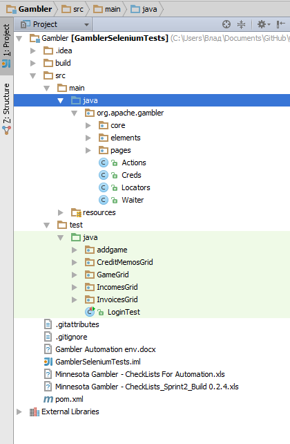

# Архитектура. Основные элементы. Примеры.

Что же такое архитектура? Это, по сути своей, структура разрабатываемой программы,  описание того, как внутри устроены компоненты и как они друг с другом взаимодействуют. Кто-то может подумать , мол это же просто автотесты, зачем тут такие сложные процессы, проектирование архитектуры. Но это очень большое заблуждение.

Отсутсвие архитекуры при проектирование тестового  фреймворка приводит к многочисленным переписываниям кода,что в свою очередь требует серьезных временых затрат. Но, как говориться, "Время - деньги". Следствие всего этого потеря прибыли и недовольство заказчиков. Поэтому лучше на старте проекта об этом задуматься. И вот какие вопросы нужно решить:

* Архитектура самих тестов: паттерны, вспомогательные классы и т.д.
* Конфигурирование тестов (какие запускать, а какие нет)
* Получение данных для тетов (файлы, базы данных и т.д.)
* Хранение и генерация отчетов
* Хранение вспомогательных утилит

Хочется сразу скахать, что универсального решения нет. Все завситит от особеностей проекта, используемых технологий и желания заказчика. Вот как выглядит пример простой, но достаточно эффективой архитекруры:

