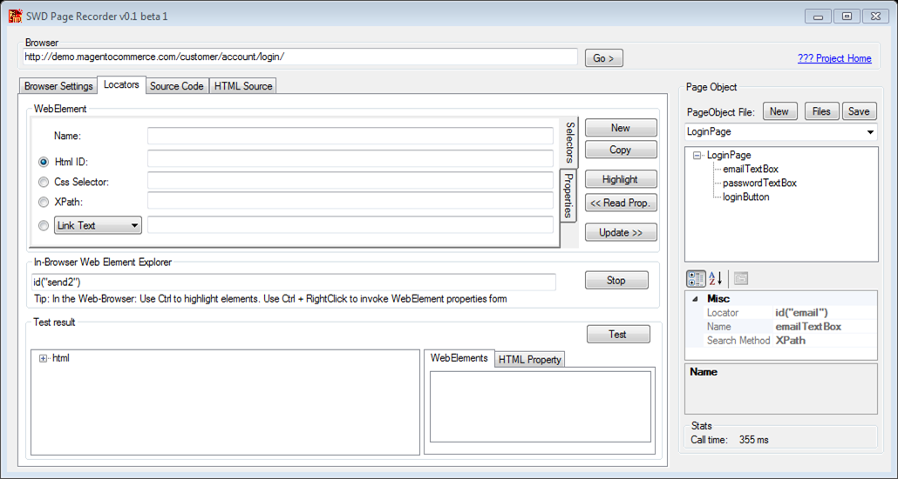

# Вспомогательные инструменты.

## SWD Page Recorder

SWD Page Recorder помогает записать локаторы элементов веб-страницы, отладить их в самом приложении и генерировать код PageObject-классов на C#, Java, Python, Ruby, Perl для дальнейшего использования в авто-тестах на Selenium WebDriver. Данный инструмент позволяет не только найти необходимый локатор, но и оптимизировать его, и сгенерировать весь необходимый код для последующей вставки декларации элемента в код. 

SWD Page Recorder – это единый инструментарий для работы с локаторами во всех браузерах, с которыми умеет работать WebDriver. Важным моментом является то, что Page Recorder тестирует всё через сам WebDriver – так что у вас не будет случаев, когда локатор, найденный другим путем – может не работать в WebDriver.

Домашняя страница: http://swd-tools.com/

Исходники: https://github.com/dzharii/swd-recorder/releases

## Selenium Builder

Selenium Builder – это расширение для Firefox, позволяющие записывать тесты в бот-стиле. Работать с ним можно даже не зная языков программирования, как и с Selenium IDE.

Selenium Builder позволяет:

* записывать и проигрывать тесты
* поддерживает Selnium 1.0 и Selenium 2.0
* позволяет экспортировать записанные скрипты в языки программирования

Домашняя страница: http://sebuilder.github.io/se-builder/

Исходники: https://github.com/sebuilder/se-builder
