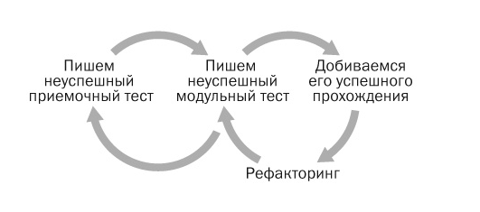

# Обзор методологии и инструментов на Java.

В эпоху «сначала тестирование» поведение пользователя выражалось в основном через модульные тесты, написанные на языке системы, т.е. на языке, непонятном пользователю. С появлением методик разработки на основе поведений (Behavior-Driven Development, BDD) эта динамика меняется. Используя методики BDD, вы можете создавать автоматизированные тесты на языке бизнеса, в то же время сохраняя связь с реализуемой системой.

Конечно, был создан целый ряд инструментов, помогающих реализовать BDD в процессе разработки. К ним относятся Cucumber-JVM в Java, SpecFlow для Microsoft .NET Framework и еще множество других для разных языков программирования. Инеструменты реализации BDD подхода упрощают написание и выполнение спецификаций в средах разработки, а использование Selenium WebDriver позволяет управлять браузером для комплексного автоматизированного тестирования системы.

Многие считают BDD надмножеством TDD, но не его заменой. Ключевая разница — фокусировка на начальном проекте и создании тестов. Но основное внимание уделяется не тестам модулей или объектов, как в TDD, а целям пользователей и пошаговым операциям, предпринимаемым ими для достижения этих целей. Поскольку мы больше не начинаем с тестов малых модулей, меньше проявляется склонность размышлять над деталями проекта или использовать более мелкие части. Вместо этого документируются исполняемые спецификации, которые контролируют всю систему. В результате по-прежнему получаются модульные тесты, но в BDD поощряется подход «от внешнего к внутреннему» (outside-in approach), который начинается с полного описания подлежащей реализации функции.

Цикл разработки на основе поведений (BDD):

